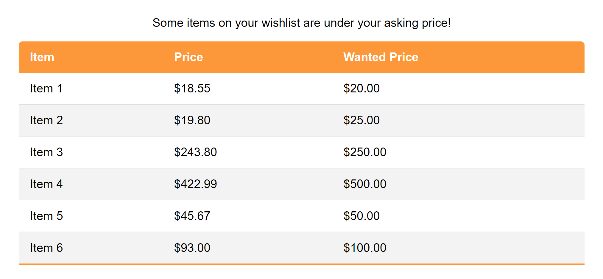

# Amazon Price Tracker

A python web scraper that reads information from an Amazon wishlist and sends an email if any items drops below a specific price specified under the items comments

*Example Email:*
 

# Requirements

- Python 3
- modules: dotenv, pandas, selenium, ssl, smtplib, and more (view source file)

# .env File Format

```
FILENAME='<filename>.csv'
WISHLIST_URL='<amazon wishlist url>'
RECEIVER_EMAIL='<address to send emails to>'
SENDER_EMAIL='<address the emails are coming from>'
SENDER_PASSWORD='<password for the sender's email>'
```

> Note: for this to work you may need to use an email account with 2-step verification turned off as well as access to less secure apps. you can learn more [here](https://support.google.com/accounts/answer/6010255?p=less-secure-apps&hl=en&visit_id=637561037754636750-284641031&rd=1).